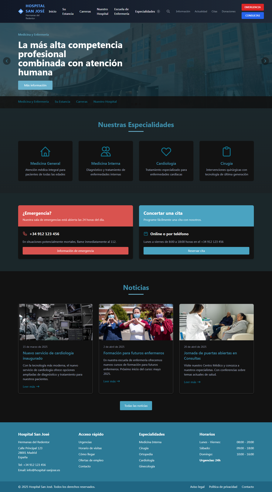
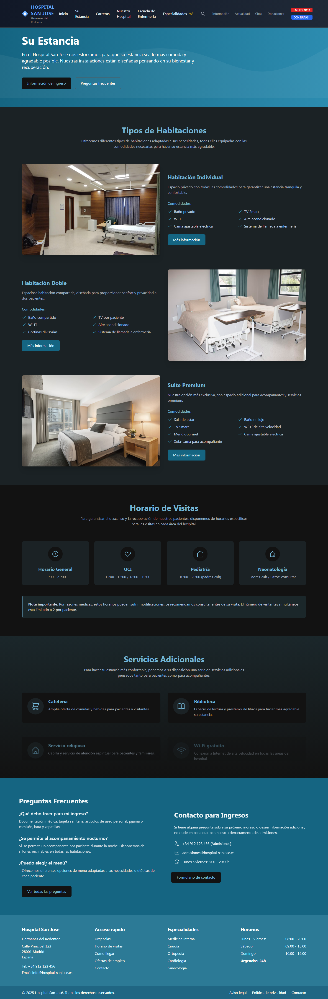

<div align="center">
  <h1>🏥 Hospital San José</h1>
  <h3>Sitio Web Institucional</h3>
  <p><em>Plataforma digital moderna para servicios de salud integral</em></p>
  
  [](https://opensource.org/licenses/MIT)
  [](https://www.typescriptlang.org/)
  [](https://reactjs.org/)
  [](https://vitejs.dev/)
  [](https://tailwindcss.com/)
</div>

---

## 📸 Vista Previa

<div align="center">
  
  
  
</div>

## 📋 Descripción

Sitio web oficial del **Hospital San José de las Hermanas del Redentor**. Una plataforma digital moderna, accesible y completamente responsiva que proporciona:

- 🔍 Información detallada sobre servicios médicos
- 📅 Sistema de gestión de citas médicas
- 📚 Recursos educativos para pacientes y profesionales
- 🏥 Información institucional completa
- 🌐 Experiencia de usuario optimizada en todos los dispositivos

## ✨ Características Principales

### 🏥 **Servicios Médicos**
- **Especialidades Médicas Completas** - Catálogo detallado de todas las especialidades disponibles
- **Sistema de Emergencias** - Información crítica para situaciones de urgencia
- **Gestión de Consultas** - Plataforma intuitiva para agendar y administrar citas

### 🎓 **Programas Educativos**
- **Escuela de Enfermería** - Información completa sobre programas académicos
- **Carreras y Especializaciones** - Oferta educativa actualizada
- **Recursos para Estudiantes** - Material de apoyo y guías académicas

### 🎨 **Experiencia de Usuario**
- **Tema Dual** - Modo claro y oscuro para comodidad visual
- **Diseño Responsivo** - Optimizado para móviles, tablets y desktop
- **Animaciones Fluidas** - Transiciones suaves powered by Framer Motion
- **Navegación Intuitiva** - UX/UI centrada en el usuario

### 🔒 **Calidad y Performance**
- **TypeScript** - Desarrollo tipado para mayor robustez
- **Testing Suite** - Pruebas automatizadas con Vitest
- **Linting y Formatting** - Código consistente con ESLint y Prettier
- **SEO Optimized** - Estructura optimizada para motores de búsqueda

## 🛠️ Stack Tecnológico

### **Frontend Framework**
- **React 18.3.1** - Biblioteca principal para interfaces de usuario
- **TypeScript 5.6.2** - Superset tipado de JavaScript
- **Vite 6.2.3** - Build tool de nueva generación

### **Styling & Animation**
- **Tailwind CSS 3.4.17** - Framework CSS utility-first
- **Framer Motion 12.6.2** - Biblioteca de animaciones para React
- **Tailwind CSS Animate 1.0.7** - Animaciones preconstruidas

### **Routing & Icons**
- **React Router DOM 7.4.1** - Enrutamiento declarativo
- **Lucide React 0.486.0** - Biblioteca de iconos moderna

### **Development Tools**
- **ESLint + Prettier** - Linting y formateo de código
- **Vitest** - Framework de testing ultrarrápido
- **Testing Library** - Utilidades para testing de componentes React

## 📋 Requisitos del Sistema

- **Node.js** `>= 18.0.0`
- **npm** `>= 9.0.0` o **yarn** `>= 1.22.0` o **pnpm** `>= 8.0.0`
- **Git** para control de versiones

## 🚀 Instalación y Configuración

### 1️⃣ **Clonar el Repositorio**
```bash
# HTTPS
git clone https://github.com/[usuario]/hospital-san-jose-website.git

# SSH
git clone git@github.com:[usuario]/hospital-san-jose-website.git

# Navegar al directorio
cd hospital-san-jose-website
```

### 2️⃣ **Instalar Dependencias**
```bash
# Con npm
npm install

# Con yarn
yarn install

# Con pnpm
pnpm install
```

### 3️⃣ **Ejecutar en Modo Desarrollo**
```bash
# Iniciar servidor de desarrollo (disponible en todas las interfaces de red)
npm run dev

# El servidor estará disponible en:
# - Local: http://localhost:5173
# - Network: http://[tu-ip]:5173
```

### 4️⃣ **Scripts Disponibles**
```bash
# Desarrollo
npm run dev          # Inicia servidor de desarrollo
npm run preview      # Preview de build de producción

# Build y Deploy
npm run build        # Crea build optimizado para producción

# Calidad de Código
npm run lint         # Ejecuta linting y type checking
npm run format       # Formatea código con Prettier

# Testing
npm run test         # Ejecuta suite de pruebas
npm run test:coverage # Ejecuta pruebas con reporte de cobertura
```

## 🏗️ Arquitectura del Proyecto

```
hospital-website/
├── 📁 public/                    # Archivos estáticos
│   ├── favicon.ico
│   └── robots.txt
├── 📁 src/
│   ├── 📁 components/            # Componentes reutilizables
│   │   ├── 📁 ui/               # Componentes base (Button, Card, etc.)
│   │   ├── 📁 layout/           # Componentes de layout
│   │   │   ├── Navbar.tsx
│   │   │   ├── Footer.tsx
│   │   │   └── ThemeToggle.tsx
│   │   └── 📁 shared/           # Componentes compartidos
│   ├── 📁 pages/                # Componentes de páginas
│   │   ├── 📁 Home/
│   │   ├── 📁 Emergency/
│   │   ├── 📁 Appointments/
│   │   ├── 📁 Specialties/
│   │   ├── 📁 Nursing/
│   │   └── 📁 About/
│   ├── 📁 assets/               # Recursos estáticos
│   │   ├── 📁 images/
│   │   ├── 📁 icons/
│   │   └── 📁 fonts/
│   ├── 📁 hooks/                # Custom hooks
│   ├── 📁 utils/                # Utilidades y helpers
│   ├── 📁 types/                # Definiciones de tipos TypeScript
│   ├── 📄 App.tsx               # Componente principal
│   ├── 📄 main.tsx              # Punto de entrada
│   └── 📄 index.css             # Estilos globales
├── 📄 package.json              # Dependencias y scripts
├── 📄 tsconfig.json             # Configuración TypeScript
├── 📄 tailwind.config.js        # Configuración Tailwind CSS
├── 📄 vite.config.ts            # Configuración Vite
└── 📄 README.md                 # Documentación del proyecto
```

## 🌐 Estructura de Rutas

| Ruta | Componente | Descripción |
|------|------------|-------------|
| `/` | `Home` | Página principal con información general |
| `/su-estancia` | `Stay` | Información para pacientes hospitalizados |
| `/carreras` | `Careers` | Programas educativos y carreras |
| `/nuestro-hospital` | `About` | Historia e información institucional |
| `/medicina-enfermeria` | `Nursing` | Escuela de Enfermería |
| `/especialidades` | `Specialties` | Catálogo de especialidades médicas |
| `/emergencia` | `Emergency` | Servicios de emergencia y urgencias |
| `/consultas` | `Appointments` | Sistema de gestión de citas |

## 📱 Diseño Responsivo

### **Breakpoints de Tailwind CSS**
- **Mobile First**: `< 640px` (sm)
- **Tablet**: `640px - 768px` (md)
- **Desktop**: `768px - 1024px` (lg)
- **Large Desktop**: `1024px - 1280px` (xl)
- **Extra Large**: `> 1280px` (2xl)

### **Optimizaciones por Dispositivo**
- ✅ **Touch-friendly** - Elementos interactivos optimizados para touch
- ✅ **Performance** - Lazy loading de imágenes y componentes
- ✅ **Accesibilidad** - Navegación por teclado y lectores de pantalla
- ✅ **SEO** - Meta tags dinámicos y estructura semántica

## 🎨 Sistema de Temas

### **Tema Claro** ☀️
- Fondo blanco con elementos en tonos suaves
- Excelente legibilidad durante el día
- Colores corporativos del hospital

### **Tema Oscuro** 🌙
- Fondo oscuro que reduce fatiga visual
- Ideal para uso nocturno
- Mantiene la identidad visual del hospital

## 🧪 Testing

```bash
# Ejecutar todos los tests
npm run test

# Ejecutar tests en modo watch
npm run test:watch

# Generar reporte de cobertura
npm run test:coverage

# Ejecutar tests de un componente específico
npm run test -- --grep "ComponentName"
```

### **Cobertura de Testing**
- ✅ Componentes de UI
- ✅ Utilidades y helpers
- ✅ Custom hooks
- ✅ Integración de rutas

## 📊 Performance y Optimización

### **Métricas Objetivo**
- **First Contentful Paint**: < 1.5s
- **Largest Contentful Paint**: < 2.5s
- **Cumulative Layout Shift**: < 0.1
- **Time to Interactive**: < 3.5s

### **Optimizaciones Implementadas**
- 🚀 **Code Splitting** - Carga lazy de componentes
- 🖼️ **Image Optimization** - Formatos modernos y lazy loading
- 📦 **Bundle Optimization** - Tree shaking y minificación
- 💾 **Caching Strategy** - Service Worker para recursos estáticos

## 🤝 Contribución

¡Las contribuciones son bienvenidas! Por favor sigue estas pautas:

### **Proceso de Contribución**

1. **Fork** el repositorio
2. **Crea** una rama para tu feature:
   ```bash
   git checkout -b feature/amazing-feature
   ```
3. **Realiza** tus cambios siguiendo las convenciones de código
4. **Ejecuta** las pruebas:
   ```bash
   npm run test
   npm run lint
   ```
5. **Commit** tus cambios:
   ```bash
   git commit -m "feat: add amazing feature"
   ```
6. **Push** a tu rama:
   ```bash
   git push origin feature/amazing-feature
   ```
7. **Abre** un Pull Request

### **Convenciones de Código**
- ✅ Usar TypeScript para nuevos componentes
- ✅ Seguir las reglas de ESLint configuradas
- ✅ Escribir tests para nuevas funcionalidades
- ✅ Documentar componentes complejos
- ✅ Usar Conventional Commits para mensajes

## 📧 Contacto y Soporte

### **Hospital San José**
- 🌐 **Website**: [www.hospitalsanjose.com](https://www.hospitalsanjose.com)
- 📧 **Email**: contacto@hospitalsanjose.com
- ☎️ **Teléfono**: +1 (555) 123-4567
- 📍 **Dirección**: [Dirección del Hospital]

### **Equipo de Desarrollo**
- 💻 **Tech Lead**: [Nombre del líder técnico]
- 🎨 **UI/UX Designer**: [Nombre del diseñador]
- 🧪 **QA Engineer**: [Nombre del QA]

## 📄 Licencia

Este proyecto está licenciado bajo la **Licencia MIT** - consulta el archivo [LICENSE](LICENSE) para más detalles.

## 🏆 Reconocimientos

- **Hospital San José** - Por confiar en este proyecto
- **Hermanas del Redentor** - Por su labor humanitaria
- **Comunidad Open Source** - Por las herramientas utilizadas
- **Contribuidores** - Por hacer este proyecto posible

---

<div align="center">
  <p><strong>Desarrollado con ❤️ para el Hospital San José</strong></p>
  <p><em>Comprometidos con la salud y el bienestar de nuestra comunidad</em></p>
  
  
  
</div>
